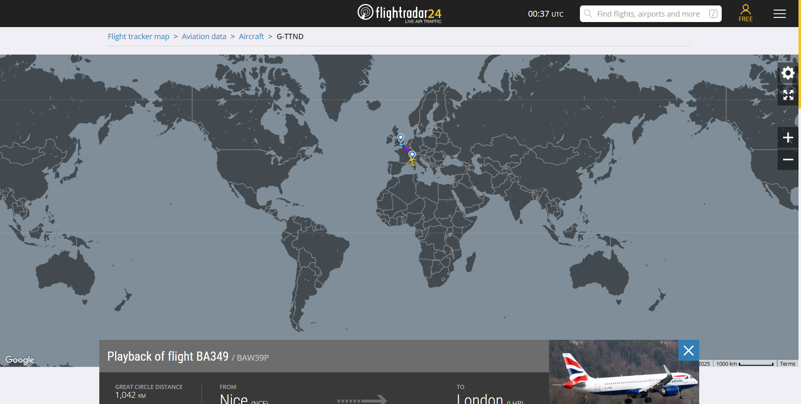
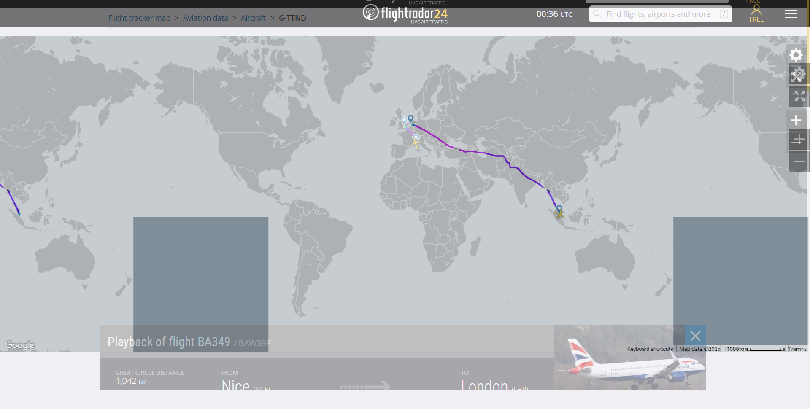
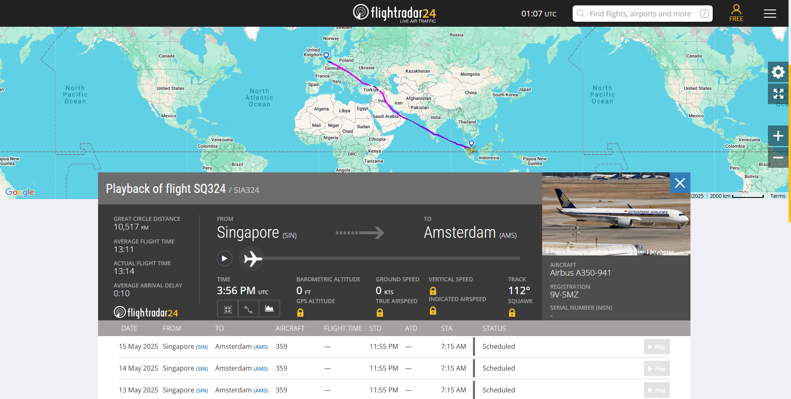
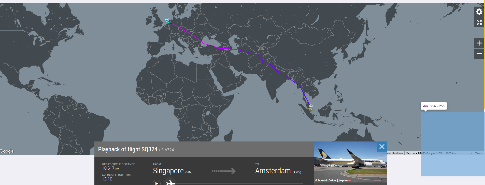

# flight

## Author
hilmo

## Description
Hiiiii 🥶🥶🥶 That was such a long trip! I basically slept the whole time on the plane. Woke up a few times just to eat. Honestly, it was a pretty chill journey and I like this capital. See you again, I will eat with my friend at 8:00.

Format FLAG: FindITCTF{FROM_DEST_FLIGHTNUMBER_AIRCRAFT-TYPE}

## Solution
1. Select any random flight on [flightradar24.com](https://www.flightradar24.com/) and adjust the scale to match the given image.

2. Open any image editor and adjust the position of the grid to match the plane's position.

3. Based on that, the plane must be flying from Singapore to the Netherlands. From the description, we know it will land in Amsterdam (the capital of the Netherlands).

4. Check the flights from Singapore to Amsterdam on [flightradar24.com](https://www.flightradar24.com/).

5. Only KLM and Singapore Airlines have direct flights from Singapore to Amsterdam. KLM flights arrive at 8:00, which does not match the description above. So the only possible flight is SQ324 from Singapore Airlines.

#### how to find the grid position:

- inspect element
