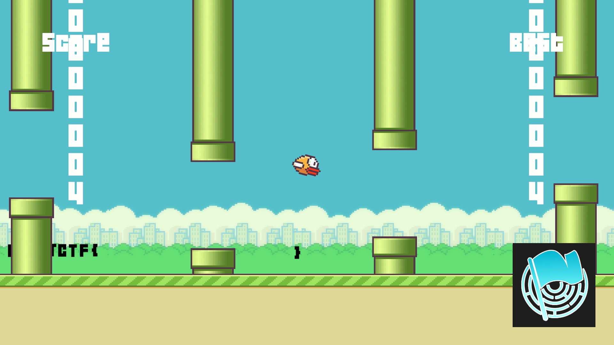
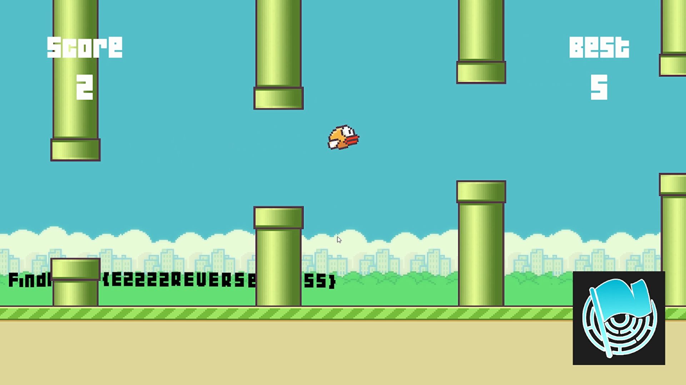
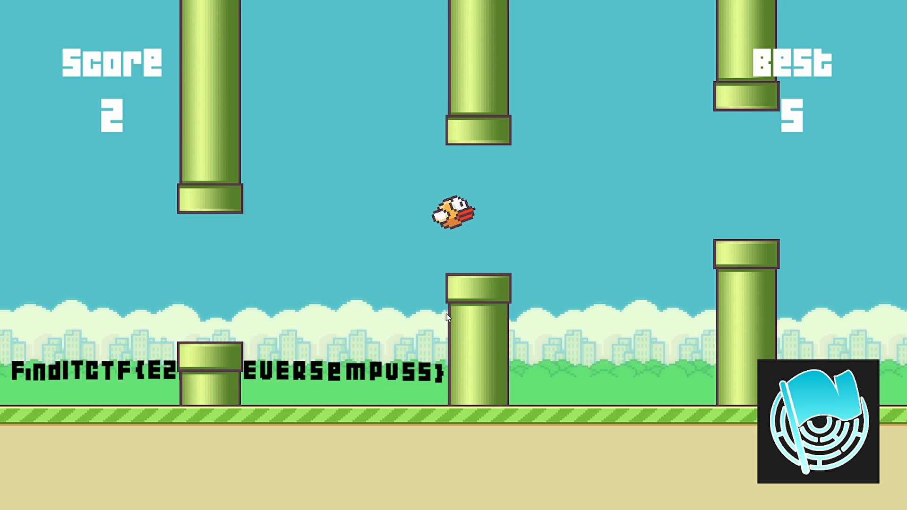

# ezBird

## Author
hilmo

## Description
Beat my score and I will give you the flag. Don't cheat!

Hint: My score = 9999999

## Solution
If we try to directly change the memory, we only get an empty FLAG.



Because of that, we should check the code behind this game. This Unity game is compiled with IL2CPP, so we need to decompile the game first. I used [Il2CppDumper](https://github.com/Perfare/Il2CppDumper) and Ghidra to do this.

After successfully decompiling the game, we can see the code inside the `AddScor` function. Here is the interesting part:

``` 
...
if (*(double *)(param_1 + 0x38) <= -30000000.0 && *(double *)(param_1 + 0x38) != -30000000.0) {
if (*(longlong *)(param_1 + 0x40) == 0) goto LAB_18040a01a;
UnityEngine.GameObject$$SetActive(*(longlong *)(param_1 + 0x40),1,0);
}
if (99999999 < *(int *)(param_1 + 0x30)) {
if (*(longlong *)(param_1 + 0x48) == 0) goto LAB_18040a01a;
UnityEngine.GameObject$$SetActive(*(longlong *)(param_1 + 0x48),1,0);
}
...
```

That code will toggle two different objects with different conditions. One must be the empty flag above and another one is the real FLAG. Checking the previous code

```
...
*(int *)(param_1 + 0x30) = *(int *)(param_1 + 0x30) + 1;
...
*(double *)(param_1 + 0x38) = *(double *)(param_1 + 0x38) - 0.3;
...
```

We can see that the `param_1 + 0x30` will be increased by 1, and the `param_1 + 0x38` will be decreased by 0.3. Initially, we set a value so it will exceed 99999999. However, this results in the empty flag, so it must be the `param_1 + 0x30` that changed. If we try modifying the other one (`param_1 + 0x38`), we should get the flag.




