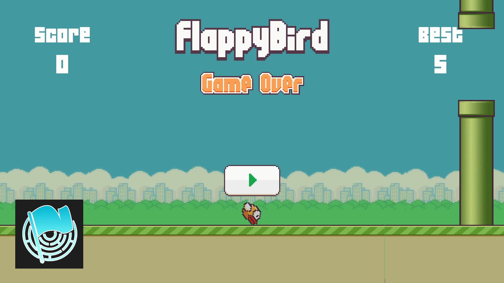
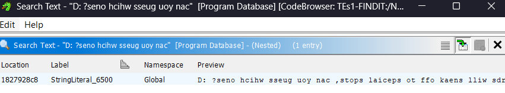

# lazyBird

## Author
hilmo

## Description
This is my first time making a Unity game, so I hope you enjoy it!

Unity seems to compress all of my files, so I made sure the flag stays in the same format as the original file.

## Solver
Based on the challenge description, the flag must be inside the StreamingAssets folder. We find `note.txt` inside that folder:

```
the flag is split into two parts
one will be shown on the screen (I think?)
and the other is inside the 7z file

oh, dont forget to kill the game after exiting. looks like the exit logic’s a bit broken (still learning unity)
debug is on
```

### Flag Part 1

If we run the game, there will be a CTF FINDIT 2025 logo in the bottom left corner, and the logo will also be inside the StreamingAssets folder. Check the hex, and you can see a Base64 string at the bottom.



```
X0c0blk0bmdfZnVmdWI0YjRfZnVmdWYxZm4xfQ==
_G4nY4ng_fufub4b4_fufuf1fn1}
```

### Flag Part 2

#### Step 1

Based on `note.txt`, we need to extract the 7z file. However, it's password-protected. The last line in `note.txt` suggests checking the debug log folder. The default location for Unity debug logs is `%APPDATA%\LocalLow\<company_name>\<game_name>\`.

Check the files in that folder. We find `player.txt`, which contains some interesting, weird text

```
D: ?seno hcihw sseug uoy nac ,stops laiceps ot ffo kaens lliw sdrow terces emoS .tnof eht ni srettel eht lla elffuhs lliw sihT [wtb tnatropmi si redro]
```

Flip the text, and we get:

```
]order is important btw[ This will shuffle all the letters in the font. Some secret words will sneak off to special spots, can you guess which ones? :D
```

But we still need to find the password. That debug line suggests checking the code where the debug line is triggered.

#### Step 2

Because this Unity game is compiled with IL2CPP, we need to decompile the game first. I used [Il2CppDumper](https://github.com/Perfare/Il2CppDumper) and Ghidra to do this.

After decompiling the game, we can search for the debug line.



Analyze the function. At the start, the function randomizes many sprites to different positions. Since `note.txt` says some secret words will sneak off to special spots, we can assume that the letters (sprites in this case) will change positions again to different spots. Go to the bottom of the function

```
LAB_18040b88f:
      local_a0 = uVar5;
      local_a8 = uVar11;
      if (DAT_1828f39d1 == '\0') {
        FUN_180375db0(&Method$UnityEngine.Object.MarshalledUnityObject.MarshalNotNull<Transform>() );
        LOCK();
        UNLOCK();
        DAT_1828f39d1 = '\x01';
      }
      lVar9 = unaff_RBX[2];
      if (lVar9 == 0) goto LAB_18040b9a6;
      pcVar10 = DAT_1828f39f8;
      if (DAT_1828f39f8 == (code *)0x0) {
        pcVar10 = (code *)FUN_18036b860(
                                       "UnityEngine.Transform::set_position_Injected(System.IntPtr,UnityEngine.Vector3&)"
                                       );
        if (pcVar10 == (code *)0x0) goto LAB_18040b990;
      }
      DAT_1828f39f8 = pcVar10;
      (*DAT_1828f39f8)(lVar9,&local_a8);
    }
  }
  goto LAB_18040b7b0;
}
```

This is another function to transform objects to different positions. But what object are we transforming? Check the condition to trigger it

```
LAB_18040b7b0:
                        if (local_res20 == 0) goto LAB_18040b9bd;
                        cVar6 = FUN_1800022e0(0,System.Collections.IEnumerator_TypeInfo);
                        if (cVar6 != '\0') {
                          if (local_res20 != 0) {
                            unaff_RBX = (longlong *)
                                        FUN_1800022e0(1,System.Collections.IEnumerator_TypeInfo);
                            if (unaff_RBX != (longlong *)0x0) {
                              if ((*(byte *)(UnityEngine.Transform_TypeInfo + 0x130) <=
                                   *(byte *)(*unaff_RBX + 0x130)) &&
                                 (*(longlong *)
                                   (*(longlong *)(*unaff_RBX + 200) + -8 +
                                   (ulonglong)*(byte *)(UnityEngine.Transform_TypeInfo + 0x130) * 8)
                                  == UnityEngine.Transform_TypeInfo)) {
                                lVar9 = UnityEngine.Object$$GetName(unaff_RBX,0);
                                if (lVar9 != lVar8) goto code_r0x00018040b851;
                                goto LAB_18040b88f;
                              }
                              goto LAB_18040b9b0;
                            }
                            goto LAB_18040b98a;
                          }
                          goto LAB_18040b9b8;
                        }
                        uVar12 = FUN_18040b9e0(&local_d0);
                        uVar14 = uVar14 + 1;
                      } while( true );
                    }
                  }
                }
              }
            }
          }
        }
      }
    }
  }
  FUN_18035b230();
  pcVar10 = (code *)swi(3);
  uVar12 = (*pcVar10)();
  return uVar12;
```

This is a `System.Collections.IEnumerator`, which is used to iterate over a collection. The collection it iterates over is `FUN_18035b230();`. Check the previous function, and we get

```
do {
    if ((int)*(uint *)(lVar7 + 0x18) <= (int)uVar14) {
        return uVar12;
    }
    lVar8 = (longlong)(int)uVar14;
    if (*(uint *)(lVar7 + 0x18) <= uVar14) {
        FUN_18035b230()
```

This is where the collection comes from, so it will store the values `uVar12` and `lVar7`. Take a look at one example below

```
local_f0 = StringLiteral_6495;
...
*(undefined4 *)(lVar7 + 0xf8) = (undefined4)local_f0;
*(undefined4 *)(lVar7 + 0xfc) = local_f0._4_4_;
*(undefined4 *)(lVar7 + 0x100) = 0xc0000000;
*(undefined4 *)(lVar7 + 0x104) = 0x3f800000;
*(undefined8 *)(lVar7 + 0x108) = 0x3f800000;
```

This will become

```
("93", -2, 1, 1),
```

Get all the collections, and we will get

```
("103", 2, 1, 1),
("18", 4, 1, 1),
("85", -5, 1, 1),
("101", -3, 1, 1),
("94", 1, 1, 1),
("5", 0, 1, 1),
("104", 3, 1, 1),
("75", -4, 1, 1),
("92", -1, 1, 1),
("93", -2, 1, 1),
```

Now we know the objects we will transform. Basically, the collection is

```
("string", x, y, z)
```

Check again the condition to trigger the transform

```
lVar8 = System.String$$Concat
                    (StringLiteral_6504,
                    *(undefined8 *)(lVar7 + 0x20 + lVar8 * 0x18),0)
...
lVar9 = UnityEngine.Object$$GetName(unaff_RBX,0);
if (lVar9 != lVar8) goto code_r0x00018040b851;
...
StringLiteral_6504 = "huruf_"
```

So it will concatenate `"huruf_"` with the string from the collection and check if that string is equal to the object name. If it is, we will transform the object.

#### Step 3

We are done gathering info inside the source code. Now we should find the object `huruf_*`.

Using [AssetRipper](https://github.com/AssetRipper/AssetRipper), we can extract the assets from the game.

Using `huruf_103` as an example, we can see that it has this value

```
"m_Rect": {
    "m_Height": 42,
    "m_Width": 13,
    "m_X": 131,
    "m_Y": 7
},
```

The `huruf_103` has a parent named `huruf`, and the `m_X` and `m_Y` are the positions of that object. Unity uses `0,0` as the bottom-left corner, so we can use that to find the position of the object. Thus, `huruf_103` will be "l".

Combine all the strings, and we get

```
nehpmIslaM
```

Flip it, and we get the password

```
MalsImphen
```

Open the 7z file using that password, and we get

```
FindITCTF{4y0_4y0
```
